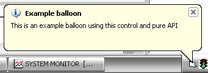



## Windows XP/2000 Popup Balloons \(now commented\!\)

### Description

This control adds an icon to your systray and has built in function to display a popup balloon and receiving clicks from it. It also includes a control for displaying popup balloons on textboxes and comboboxes. All with pure API.

Inputs:

TrayIcon.InfoTip - Sets tooltip for your systray icon (eg. TrayIcon.InfoTip = App.Title)

TrayIcon.TrayIcon - Sets icon for your systray icon (eg. TrayIcon.TrayIcon = Me.Icon (WITHOUT SET))

TrayIcon.InTray - Sets wheter the icon in the systray should be visible or not (eg. TrayIcon.InTray = True)

TrayIcon.PopupBalloon - Displays a balloon for the systray icon (eg. TrayIcon.PopupBalloon("My message", "My title", bsIconInformation))

TextBalloon.ShowBalloon - Shows a balloon for a textbox (eg. TextBalloon.ShowBalloon(Text1.hWnd, "My message", "My title", bsIconInformation))

TextBalloon.ShowComboBoxBalloon - Shows a balloon pointing at a combobox (eg. TextBalloon.ShowComboBoxBalloon(Combo1.hWnd, "My message", "My title", bsIconCritical))

Returns:

Returns events for TrayIcon as events on trayicon clicks and balloon clicks.

Side Effects:

All parameters must be set in code and not Property Viewer, for the TextBalloon control to work you need a manifest to give xp-style to your app.
 
### More Info
 
TrayIcon.InfoTip - Sets tooltip for your systray icon (eg. TrayIcon.InfoTip = App.Title)

TrayIcon.TrayIcon - Sets icon for your systray icon (eg. TrayIcon.TrayIcon = Me.Icon (WITHOUT SET))

TrayIcon.InTray - Sets wheter the icon in the systray should be visible or not (eg. TrayIcon.InTray = True)

TrayIcon.PopupBalloon - Displays a balloon for the systray icon (eg. TrayIcon.PopupBalloon("My message", "My title", bsIconInformation))

TextBalloon.ShowBalloon - Shows a balloon for a textbox (eg. TextBalloon.ShowBalloon(Text1.hWnd, "My message", "My title", bsIconInformation))

TextBalloon.ShowComboBoxBalloon - Shows a balloon pointing at a combobox (eg. TextBalloon.ShowComboBoxBalloon(Combo1.hWnd, "My message", "My title", bsIconCritical))

Returns events for TrayIcon as events on trayicon clicks and balloon clicks.

All parameters must be set in code and not Property Viewer, for the TextBalloon control to work you need a manifest to give xp-style to your app.

             |
---                |---
**Submitted On**   |2003-05-11 02:20:22
**By**             |[Johan Sköld](https://github.com/Planet-Source-Code/PSCIndex/blob/master/ByAuthor/johan-sk-ld.md)
**Level**          |Intermediate
**User Rating**    |4.5 (36 globes from 8 users)
**Compatibility**  |VB 6\.0
**Category**       |[Windows API Call/ Explanation](https://github.com/Planet-Source-Code/PSCIndex/blob/master/ByCategory/windows-api-call-explanation__1-39.md)
**World**          |[Visual Basic](https://github.com/Planet-Source-Code/PSCIndex/blob/master/ByWorld/visual-basic.md)
**Archive File**   |[Windows\_XP1599256102003\.zip](https://github.com/Planet-Source-Code/johan-sk-ld-windows-xp-2000-popup-balloons-now-commented__1-46090/archive/master.zip)

### API Declarations

All declarations already declared in code

